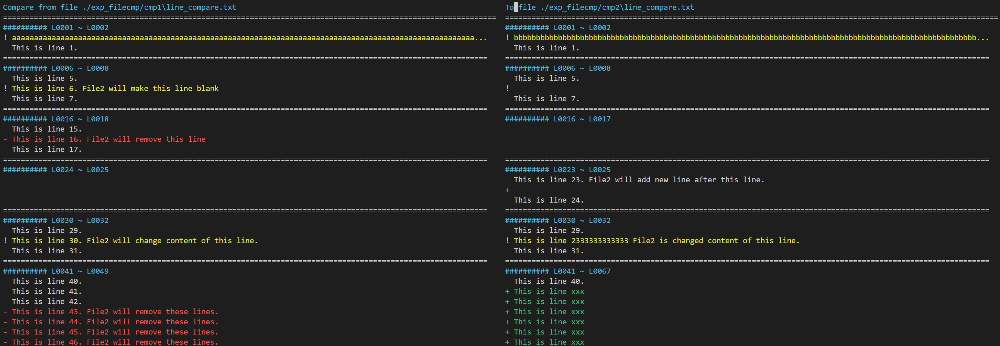

## Description

This project can run on MobaXterm terminal and may not work on VS code terminal. 

## Screenshot

## Update Logs

- 2022/11/13: 
  - Enable vim-style arrow keys (`k`, `j`, `h`, `l`). For my VS code terminal (Powershell) , the keyboard arrow keys is unable because its return value of `getkey()` is differ from [the official key list](https://docs.python.org/3.8/library/curses.html#curses.ncurses_version).
  - Add file name in the top of viewer.
  - Add the line number range for each block. 
  - Add the argument `reverse ` in CLI.

## Reference

- [Python Howto : Curses Programming with Python](https://docs.python.org/3.8/howto/curses.html)

- [Python curses — Terminal handling for character-cell displays](https://docs.python.org/3.8/library/curses.html#curses.resize_term)

- [Python difflib — Helpers for computing deltas](https://docs.python.org/3/library/difflib.html#difflib.context_diff)

- [Wasim Lorgat Build a text editor with Python and curses](https://wasimlorgat.com/posts/editor.html#scroll-the-window-to-the-cursor)

